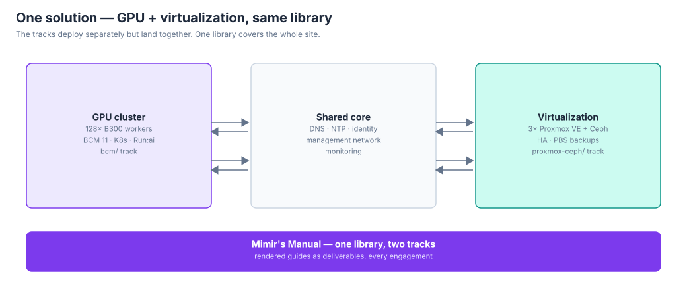

# Mimir's Manual

> The runbook library — executable, customer-anonymized deployment recipes
> for GPU and virtualization infrastructure. Pick a track, companyify it,
> build.

`library 1.0.0` · Python 3.12 stdlib-only · anonymous by design

## The tracks

| Track | Stack | Directory | For |
|---|---|---|---|
| **BCM** | BCM 11 + Kubernetes + NVIDIA Run:ai on DGX GPU nodes | `bcm/` | GPU clusters, AI factories — the 74× B300 rollout and beyond |
| **Proxmox-Ceph** | Proxmox VE + Ceph, hyperconverged, 3 nodes | `proxmox-ceph/` | General virtualization on NVMe — synchronous replication, PBS, HA |

Each track is a complete, standalone deployment package: its own
README, its own variables file, its own scripts. A site may take one
track alone, but in practice the two land together — the GPU cluster
and its virtualization under one solution — which is why they live in
one library.

## How an engagement flows


Whether the client copy/pastes alongside you, your team reviews first,
or you build and document after — the rendered site guide is always
produced. It's a final deliverable: the first and last thing the
customer sees.

## What the end result looks like




And the management stack up close — the hyperconverged Proxmox VE +
Ceph cluster that backs the whole solution:


The GPU track scales to 128 workers and beyond (256-node layouts are a
future exercise — IP planning at that scale needs its own design pass).
The virtualization track is a 3-node hyperconverged Proxmox VE + Ceph
cluster. In practice they land together as one solution, which is why
they live in one library.

## Quickstart

```bash
# 1. Pick your track and read its README first
less bcm/README.md            # GPU / Run:ai
less proxmox-ceph/README.md   # virtualization / Ceph

# 2. Companyify: fill in the one variables file per track
nvim bcm/00-variables.sh && source bcm/00-variables.sh
# or: nvim proxmox-ceph/runbook/00-overview/variables.sh

# 3. Validate, then run the track's automation (dry-run first, always)
bcm/scripts/runbook.py vars
bcm/scripts/check.sh
bash proxmox-ceph/scripts/check.sh
bash proxmox-ceph/scripts/preflight.sh --dry-run

# 4. Render the site-specific guide — always built, it's a final deliverable
bcm/scripts/runbook.py render --out site-docs/
proxmox-ceph/scripts/render.py --out site-docs/
```

## Shared conventions

Both tracks were built to the same contract, so they line up:

- **Anonymous by design** — role-based names only (`gpu-worker-1`,
  `node-1/2/3`), no customer identifiers anywhere, credentials as
  placeholders. The anonymizer pack (see `bcm/README.md`) scrubs source
  bundles before they leave your laptop.
- **Variables-first** — one file per site holds every site value
  (`bcm/00-variables.sh`, `proxmox-ceph/runbook/00-overview/variables.sh`).
  Everything else is copy-pasteable as written.
- **Dry-run scripts** — automation prints what it would do before doing
  it (`--dry-run` default; `--exec` asks for confirmation). Nothing
  runs blind.
- **Validate everything** — `bcm/scripts/check.sh` (bash/YAML/Python/
  variable sanity/leak scan/pass smoke tests); Cerberus scripts are
  idempotent with `--dry-run` and confirmation prompts.
- **Docs are deliverables** — each track renders its site-specific MD guide
  (`bcm/scripts/runbook.py render`, `proxmox-ceph/scripts/render.py`);
  the Proxmox track also ships a customer-facing design brief
  (`docs/customer-design-brief.{md,docx,pdf}`).

## Layout

```
mimir-manual/
  README.md            # this file — pick a track
  docs/diagrams/       # SVG architecture + workflow diagrams (this page's figures)
  bcm/                 # BCM 11 + Kubernetes + Run:ai track
    README.md          # track guide (quickstart, pass framework, sections)
    00-overview.md … 16-infiniband.md, 99-role-mapping.md
    00-variables.sh    # the companyify target
    scripts/           # runbook.py (8 passes), generators, check.sh
  proxmox-ceph/        # Proxmox VE + Ceph track (Cerberus)
    README.md          # track guide
    runbook/           # 00-overview … 07-validation, one dir per section
    scripts/           # preflight.sh, net-verify.sh, backup-drill.sh
    docs/              # design briefs, diagrams, references
```

## Requirements

- **BCM track:** Python 3.12 (stock on Ubuntu 24.04 / DGX OS), stdlib
  only; `cmsh` passes run on the BCM head node as root.
- **Proxmox track:** Proxmox VE 9.2.x nodes; scripts run on the nodes
  themselves (see each script's header).

## Conventions

- `bash` blocks run on the relevant head/management node unless labeled
  otherwise.
- `<PLACEHOLDER>` values must be replaced; `UPPER_CASE` names come from
  the track's variables file.
- Credentials are always placeholders — never commit real values.
