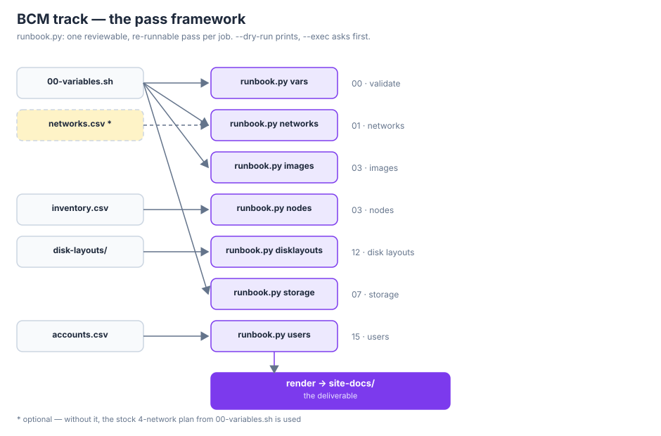
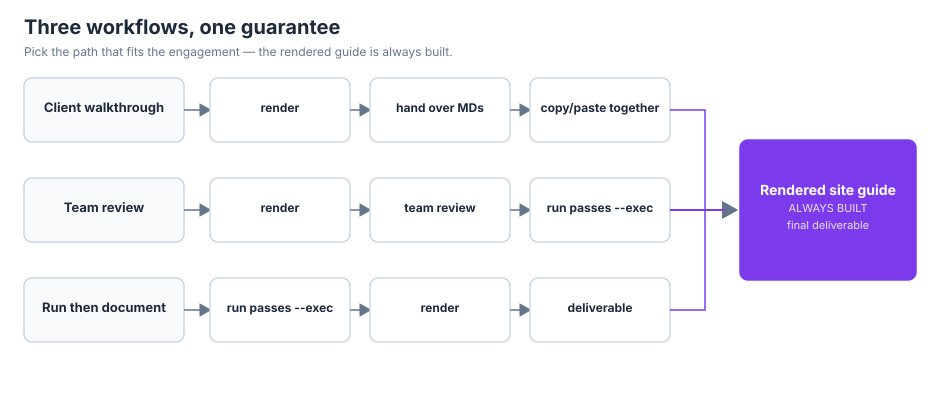
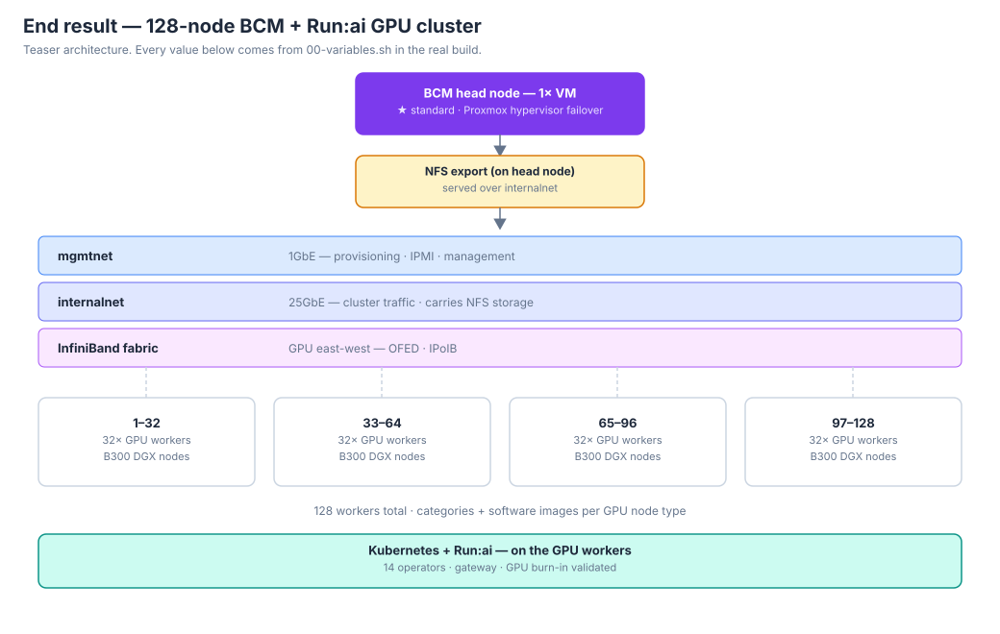

# B300 Deployment Runbook — Template

> An executable deployment recipe for BCM 11 + Kubernetes + NVIDIA Run:ai
> on DGX GPU nodes — the Chaska lab's canonical procedure, merged with the
> fixes discovered in the field, automation included.

`version 0.9.0` · `scripts/check.sh` passing · Python 3.12 stdlib-only · anonymous by design

## Quickstart

```bash
# 1. Companyify: fill in the one file that changes per site
nvim 00-variables.sh && source 00-variables.sh

# 2. Validate before anything else
scripts/runbook.py vars                                  # fails on unfilled placeholders
scripts/check.sh                                         # full template validation

# 3. Run the deployment as composable passes (dry-run first, always)
scripts/runbook.py networks --dry-run
scripts/runbook.py images --dry-run
scripts/runbook.py nodes --inventory inventory.csv --dry-run
```

## The companyify flow

1. **Copy** this directory for the site.
2. **Fill in `00-variables.sh`** — it's the only file that changes per
   deployment. Domain, networks, node names, IPs, credentials (as
   placeholder names), versions.
3. `source 00-variables.sh` on the machine you're working from.
4. **Work sections 01 → 15 in order**, or run the matching
   `runbook.py` pass. Each section lists prerequisites at the top and
   ends with verification checkboxes. (13 is optional HA and runs before
   05; 14 is greenfield infra and runs before 01.)
5. Every `bash` block is copy-pasteable once the variables are sourced.
   `<PLACEHOLDER>` values must be replaced; `UPPER_CASE` names come from
   `00-variables.sh`.

## Automation: the pass framework

The end goal is one small, reviewable, re-runnable pass per runbook
section — each driven by data files instead of hand-typed commands.
`--dry-run` is the default and prints exactly what would run; `--exec`
asks for confirmation first. Passes run on the BCM head node as root.



```
00-variables.sh ──┬──▶ runbook.py vars         validate the variables file
                  ├──▶ runbook.py networks    01 · create/align BCM networks
                  ├──▶ runbook.py images      03 · categories + software images
inventory.csv ────▶├──▶ runbook.py nodes       03 · provision nodes from CSV
disk-layouts/ ────▶├──▶ runbook.py disklayouts 12 · disk XML → category
                  ├──▶ runbook.py storage     07 · NFS CSI driver + StorageClasses
accounts.csv ─────▶└──▶ runbook.py users       15 · BCM users + sudoers drop-in
```

| Pass | Runbook | Input | Does |
|---|---|---|---|
| `vars` | 00 | `00-variables.sh` | Fails if any placeholder is unfilled |
| `networks` | 01 | variables or `networks.csv` | Creates/aligns BCM networks — **data-driven**: add rows to `networks.csv` (GPU east-west, IB, IPMI) with no code changes; `--networks` selects the file, otherwise the stock 4-network plan from variables |
| `images` | 03 | variables | Creates categories, clones images (picks `dgx-image` vs `default-image` from `GPU_NODE_TYPE`), assigns images to categories |
| `nodes` | 03 | inventory CSV | Validates, then provisions every node |
| `disklayouts` | 12 | `disk-layouts/<type>-by-path.xml` | Applies the layout at category level; stops with the collection procedure if the XML isn't built yet (it needs live hardware) |
| `storage` | 07 | variables | Installs the NFS CSI driver, generates + applies StorageClasses (`--plan 7a`: one default class; `--plan 7b`: data/scratch/models) |
| `users` | 15 | accounts CSV | Creates BCM users (minimal `cmsh` form — extra switches cause OpenLDAP weirdness); `--sudoers` emits the sudoers drop-in |
| `render` | — | variables | Builds the site-specific MD guide: copies every doc, substitutes every variable (skips `99-role-mapping.md`, warns on unfilled placeholders) |

### The three workflows



```
client walkthrough:   render -> hand the MDs over, copy/paste together
team review:          render -> review -> run the passes with --exec
run then document:    run the passes with --exec -> render as the deliverable
```

One guarantee across all three: **the rendered MD guide always gets
built.** It's a final deliverable — the first and last thing the
customer sees.

```bash
scripts/runbook.py render --out site-docs/
# 19 docs -> site-docs/, every variable filled in, placeholders flagged
```

The template docs are never modified; render writes a fresh directory
every time. The template stays pristine — the site's truth lives in
`00-variables.sh` + the three CSVs.

### Writing a new pass

1. Add a `pass_<name>(vars_, args)` function in `scripts/runbook.py` —
   build a command list, print it under `--dry-run`, run it under
   `--exec` via the `run_commands()` helper.
2. Register it in the subparsers (deployment order) and the dispatch
   dict at the bottom of `main()`.
3. Add any new inputs to `REQUIRED_VARS` so `runbook.py vars` catches
   them missing.
4. Add a smoke line to `scripts/check.sh` and a row to the table above.

Next candidates: `certs` (06), `k8s` (05, wrapping `cm-kubernetes-setup`
flags), `backup` (11).

## End result



What a completed build looks like: HA head-node pair, 128 B300 workers
in four blocks of 32, three fabrics (mgmt, cluster, InfiniBand),
head-node NFS with the CSI driver, Kubernetes + Run:ai on top — every
value from `00-variables.sh`, every step from the rendered guide.
256-node layouts are a future exercise (IP planning at that scale needs
its own design pass).

## Sections

| # | File | What happens |
|---|---|---|
| — | `00-overview.md` | How to use this template |
| — | `00-variables.sh` | **The companyify target** — all site values |
| 01 | Environment & IP plan | Networks, DNS, inventory — get sign-off first |
| 02 | BCM head node install | ISO, licensing, upgrades, base config |
| 03 | Images, categories, nodes | Software images, categories, provisioning, IPMI |
| 04 | NVIDIA drivers | Driver install/repair inside images |
| 05 | Kubernetes | `cm-kubernetes-setup`, 14-operator set |
| 06 | Run:ai | Certs, `cm-runai-setup`, gateway listeners, placement, backups |
| 07 | Storage | Head-node NFS + CSI driver; **7A** simple / **7B** advanced plans |
| 08 | Validation | GPU, platform, workload smoke tests |
| 09 | NIM Operator | NGC secrets, NIMCache, model validation |
| 10 | Decisions & issues | Deviation log |
| 11 | Backup, recovery, handoff | Backups, rollback, handoff checklist |
| 12 | Disk layouts | by-path XMLs per DGX model |
| 13 | BCM HA (optional) | `cmha-setup` — before 05 |
| 14 | Greenfield infra | Jumpbox, DNS, Chrony — before 01 |
| 15 | User management | BCM users from CSV, sudoers, image push |
| 16 | InfiniBand / GPU fabric | OFED, subnet manager, IPoIB, fabric bandwidth check |
| 99 | Role mapping | Lab ↔ client ↔ template identifier Rosetta Stone |

Delete `99-role-mapping.md` from an instantiated site copy — it
documents the merge, not the deployment.

## Scripts

`scripts/` holds the table-driven tooling. Everything reads plain CSVs
you can build in a spreadsheet and export.

| Script | Purpose |
|---|---|
| `runbook.py` | **Pass runner** — composable sub-passes, one per runbook job (above) |
| `check.sh` | **Validate everything** — run after any edit, before any commit |
| `generate-nodes.py` | Node inventory CSV → `cmsh` provisioning script (dup-IP/MAC/hostname checks, `--skeleton` for fill-in sheets) |
| `generate-users.py` | Account CSV (`username,sudo`) → minimal `cmsh -q` user-creation script (dup-username checks); `--sudoers` emits the sudoers drop-in; `accounts-template.csv` is the fill-in starter |
| `networks-template.csv` | Fill-in starter for the data-driven `networks` pass |

## Anonymizer pack (optional)

`anonymizer-pack.tar.gz` (separate download) is the companion tool for
scrubbing a *source* bundle — raw client docs, Obsidian exports — before
they leave your laptop. Four passes, stdlib-only, no network, no LLM:

1. **Client names** → stand-in (`--replacement`, default `Wayland Megacorp`)
2. **Networks** → sequential doc ranges (`10.10.11.0/24`, …; host octets preserved)
3. **InfiniBand** → `<ib-guid-001>` etc.
4. **Hostnames** → `node-001.example.internal`, … (explicit `--domains` list)

It re-scans its own output and prints `LEAK` lines for anything that
survived. Always `--dry-run` first.

```bash
tar -xzf anonymizer-pack.tar.gz && cd anonymizer-pack
./anonymize.py --client "Acme Widgets" --domains "acme.com" --scan ~/obsidian/bcm-bundle | nvim -
./anonymize.py --client "Acme Widgets" --domains "acme.com" --dry-run ~/obsidian/bcm-bundle | nvim -
./anonymize.py --client "Acme Widgets" --domains "acme.com" --out ~/bcm-bundle-anon ~/obsidian/bcm-bundle
```

Use `--client-file names.txt` (one per line) so real customer names never
land in shell history. This template itself was scrubbed with it — the
`check.sh` leak scan is the ongoing guard.

## Requirements

- **Python 3.12** — stock on Ubuntu 24.04, which is what DGX OS and the
  BCM head node are based on. No pip packages needed; everything here
  is standard library only (`csv`, `argparse`, `ipaddress`, `re`,
  `subprocess`). Verify: `python3 --version`
- `cmsh` passes run **on the BCM head node** as root.
- `bash`, standard coreutils.

## Conventions

- `bash` blocks run on the BCM head node unless labeled otherwise.
- Field notes (`> **Field note**`) mark where the client deployment
  diverged from the lab procedure — read them.
- `[restored]` marks lab procedures the client docs had dropped.
- Credentials are always placeholders — never commit real values.
