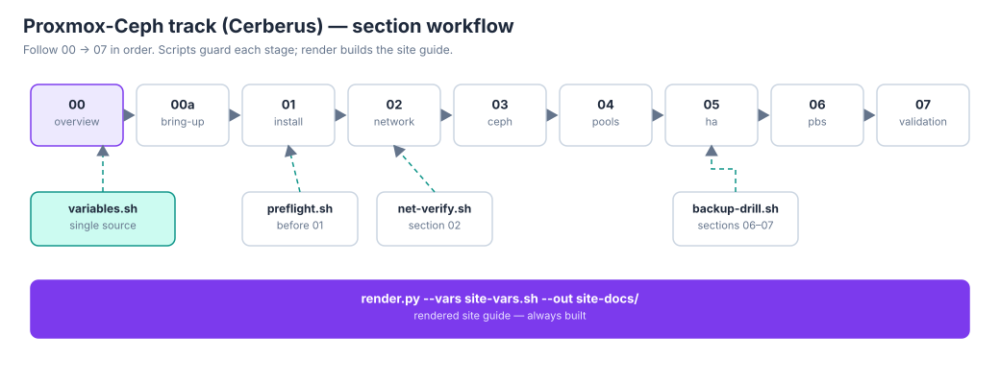
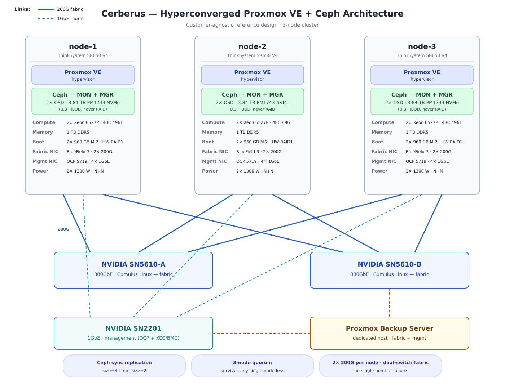

# Cerberus

The reusable hyperconverged **Proxmox VE + Ceph** runbook — three nodes standing guard.

## What this is

A customer-agnostic, step-by-step runbook for designing, building, and validating a
hyperconverged Proxmox VE + Ceph cluster (3 nodes, 4th optional): synchronous
replication, Proxmox Backup Server, HA, and failure testing. Built from real
deployment work and anonymized throughout (role-based names only), so it can be
reused for any customer — and for the lab.

## Status

Complete. The full step-by-step runbook lives under `runbook/` (00-overview
through 07-validation, plus 00a physical bring-up), with guarded scripts in
`scripts/` and the customer-facing briefs in `docs/`. The locked-in decisions,
hardware baseline, and original open questions are preserved in
[docs/runbook-starting-point.md](docs/runbook-starting-point.md).

## Quickstart

```bash
# 1. Companyify: copy the variables file per site, fill in every value
cp runbook/00-overview/variables.sh site-vars.sh
nvim site-vars.sh          # replace every PLACEHOLDER

# 2. Validate the track
scripts/check.sh

# 3. Render the site-specific guide (see below), then follow it 00 -> 07
scripts/render.py --vars site-vars.sh --out site-docs/
```

## The three workflows


**1. Client walkthrough** — they copy/paste, you guide:
```bash
scripts/render.py --vars site-vars.sh --out client-docs/
# hand over client-docs/; walk through it together, copy/paste per section
```

**2. Team review, then build:**
```bash
scripts/render.py --vars site-vars.sh --out review-docs/   # team reviews this
# ...after sign-off, on the nodes:
scripts/preflight.sh
# ...then follow runbook/ 00 -> 07
```

**3. Build first, document after** (the favorite):
```bash
# on the nodes, just build it:
scripts/preflight.sh
# ...follow runbook/ 00 -> 07...
# ...when the build is done, the deliverable:
scripts/render.py --vars site-vars.sh --out final-docs/
```

One guarantee across all three: **the rendered guide always gets built.**
It's a final deliverable — the first and last thing the customer sees.

The template docs are never modified; render writes a fresh directory every
time. The template stays pristine — the site's truth lives in your
`site-vars.sh`. Only variables defined in `variables.sh` are substituted;
shell loop variables inside the docs (e.g. `${NODE_NUM}`, set per-node at
deploy time) are left untouched. Anything still `PLACEHOLDER` or empty is
reported, not hidden.

## Section workflow



Follow the sections 00 → 07 in order (00a physical bring-up first on
baremetal). The scripts guard each stage: `preflight.sh` before the
install, `net-verify.sh` after the network build, `backup-drill.sh`
around the PBS work — and `render.py` turns the whole thing into the
site's deliverable.

## End result



Three ThinkSystem SR650 V4 nodes, hyperconverged: Proxmox VE cluster on
top, Ceph Tentacle underneath (MON/MGR/OSD per node, size=3/min_size=2),
HA with hardware watchdog fencing, Proxmox Backup Server on its
dedicated host, and a validation section that proves it by breaking
things on purpose.

## Layout

- `docs/runbook-starting-point.md` — design decisions, hardware baseline, open questions, section outline
- `docs/customer-design-brief.md` (+ `.docx`, `.pdf`) — customer-facing design brief: architecture, specs, protection story
- `docs/customer-protection-brief.md` — one-page "you are protected" high points
- `docs/references.md` — curated official documentation links per runbook section
- `docs/diagrams/` — architecture.svg/png and cable-diagram.svg/png (generated programmatically)
- `runbook/` — the full step-by-step (one directory per section)
- `scripts/` — idempotent, guarded automation (preflight checks, `--dry-run`, confirmations);
  `render.py` builds the site-specific Markdown guide, `check.sh` is the validation gate

## Conventions

- **Customer-anonymized:** role-based node names (`node-1`, `node-2`, `node-3`), no customer
  identifiers anywhere, credentials as placeholders.
- **Variables-first:** per-site values go in `runbook/00-overview/variables.sh`; everything
  else is copy-paste.
- **Baremetal-up:** no vendor integration kit assumed — the runbook owns physical bring-up
  verification (section `00a`) through final validation.
