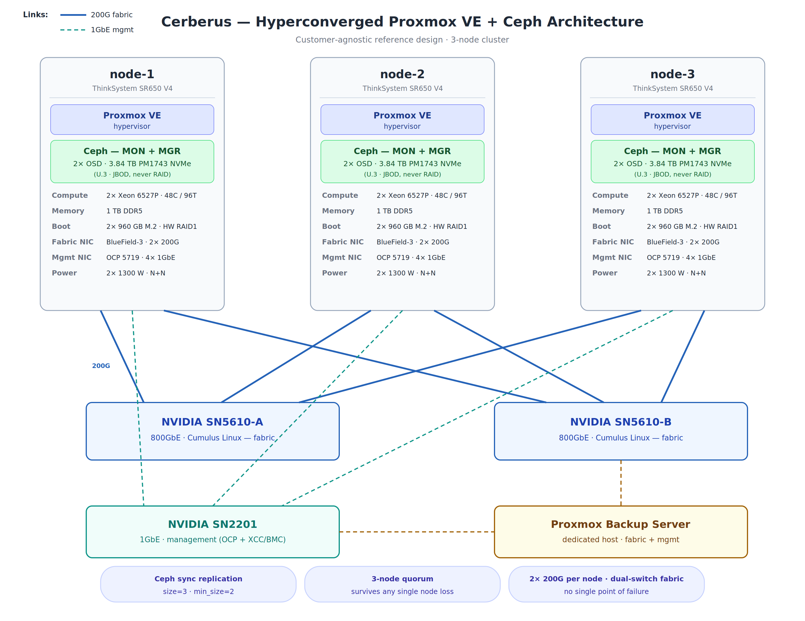

# Hyperconverged Proxmox VE + Ceph Cluster — Customer Design Brief

[ Client logo / branding ]

**Document:** Customer Design Brief
**Project:** Project Cerberus — Hyperconverged Proxmox VE + Ceph reference design
**Version:** 1.0
**Date:** October 7, 2026
**Status:** Draft for review
**Classification:** Internal / Customer

---

## 1. Executive summary

This brief describes a three-node hyperconverged cluster running Proxmox VE 9.2
for virtualization and Ceph Tentacle for shared storage. Every node runs both
workloads and storage, so there is no separate SAN, no single storage controller,
and no single server whose loss stops the cluster.

Every virtual-machine disk write is stored on all three nodes before the write
is acknowledged. If any one node fails completely, the surviving nodes keep
serving data with zero data loss, and the affected VMs are restarted
automatically within minutes.

The design uses enterprise server hardware with next-business-day on-site
support, redundant power on every node, mirrored boot drives, and two
independent high-speed network paths between every node and the storage fabric.

## 2. Design overview

- **Topology:** 3-node hyperconverged cluster (compute and storage on every node)
- **Virtualization:** Proxmox VE 9.2
- **Shared storage:** Ceph Tentacle — 3 monitors, 3 managers, 6 OSDs (2 per node)
- **Replication:** synchronous, size=3 / min_size=2 — every write lands on all
  three nodes before it is acknowledged to the VM
- **Quorum:** the cluster continues operating with any one node down
- **Backup:** Proxmox Backup Server on a dedicated host, with daily, weekly,
  and monthly retention and tested restores

Because replication is synchronous, a node failure is not a data-recovery
event. There is no replica lag to catch up, no journal to replay, and no
window of unacknowledged writes. The data is already on the surviving nodes.

## 3. Node hardware

Each of the three nodes is a Lenovo ThinkSystem SR650 V4 built identically:

| Component | Specification |
|---|---|
| Chassis | Lenovo ThinkSystem SR650 V4 (2U) |
| CPU | 2x Intel Xeon 6527P — 48 cores / 96 threads per node |
| Memory | 1 TB DDR5-6400 |
| Ceph storage | 2x 3.84 TB Samsung PM1743 NVMe PCIe 5.0 (U.3, direct-attached, JBOD — never RAID) |
| Boot | 2x 960 GB M.2 NVMe in hardware RAID1 |
| Fabric NIC | NVIDIA BlueField-3, 2x 200 GbE |
| Management NIC | 4x 1 GbE |
| Power | 2x 1300 W, N+N redundant |
| Support | 3-year next-business-day on-site |

Identical nodes mean any VM can run on any node, and a failed node can be
replaced with the same build without re-validating the configuration.

## 4. Cluster totals

| Resource | Total (3 nodes) |
|---|---|
| CPU | 144 cores / 288 threads |
| Memory | 3 TB DDR5 |
| Raw NVMe (Ceph) | 23 TB |
| Usable Ceph capacity | ~7.7 TB (after 3x replication) |
| Planned allocation | ~5 TB, leaving headroom for recovery and growth |

Storage is the binding constraint of this design. The ~5 TB planned allocation
leaves space for Ceph to re-replicate after a drive or node failure and for
workload growth. Expansion options (additional drives or a fourth node) are
covered in Section 10.

## 5. Architecture

*Figure 1 — Each node runs Proxmox VE for virtualization and Ceph services
(monitors, managers, and two OSDs) for shared storage. Nodes connect over two
independent 200G fabric paths; management traffic uses a separate 1GbE network.*

## 6. Network design

| Network | Purpose | Detail |
|---|---|---|
| Storage / Ceph fabric | Ceph replication and client I/O | Dual 200G per node, each link on a different NVIDIA SN5610 800GbE switch; MTU 9000 (jumbo frames) |
| Management | Proxmox management, cluster traffic, SSH | 1GbE switching, separate from storage traffic |

Each node's two 200G links attach to two separate switches, so the loss of one
switch or one link does not cut any node off from the storage fabric. Storage
traffic and management traffic run on separate physical networks, so a
management outage cannot disturb storage replication.

All addresses below are illustrative examples, not the actual addressing of any
site:

| Host | Management (example) | Storage fabric (example) |
|---|---|---|
| node-1 | 10.10.10.11 | 10.20.20.11 |
| node-2 | 10.10.10.12 | 10.20.20.12 |
| node-3 | 10.10.10.13 | 10.20.20.13 |

## 7. How it runs

**Proxmox VE** hosts the virtual machines. VMs are placed across the three
nodes, and Proxmox's high-availability service watches the cluster: if a node
fails, the VMs that were running on it are restarted automatically on the
surviving nodes. No operator action is required.

**Ceph** provides the shared storage underneath. Each node runs a Ceph monitor
and manager plus two OSD daemons (one per NVMe drive). Every VM disk is a Ceph
block device (RBD) with three copies spread across the three nodes. Ceph also
self-heals: when a drive or node fails, it re-replicates the affected data onto
the healthy hardware automatically while the cluster keeps serving I/O.

**Proxmox Backup Server** runs on a dedicated host outside the cluster and
holds daily, weekly, and monthly backup copies of the VMs. Restores are tested,
not assumed — a backup that has never been restored is a hope, not a plan.

## 8. Protection story

What the design means in practice, failure by failure. Plain terms:

### Drive failure

A failed NVMe drive is a maintenance event, not an outage. The data on that
drive already exists on the other two nodes, so nothing is lost and nothing
stops. Ceph detects the failure and rebuilds the missing copies onto the
healthy drives on its own, while VMs keep running. The dead drive is replaced
under the next-business-day on-site warranty.

**Outcome:** zero data loss, zero downtime.

### Full node failure

If an entire node goes down — failed board, lost power, anything — the two
surviving nodes keep serving every byte of data, because every write was
already stored on all three nodes. Proxmox HA detects the lost node and
restarts its VMs on the survivors, typically within minutes. Once a
replacement node is brought up, Ceph rebalances back to three copies.

**Outcome:** zero data loss. Recovery point objective (RPO) is effectively
zero for hardware failure — no committed write can be lost. Recovery time
objective (RTO) is minutes: the time for Proxmox HA to detect the failure and
boot the VMs elsewhere.

### Switch or network-link failure

Each node has two 200G links, one to each of the two fabric switches. If a
switch fails or a link drops, traffic continues over the remaining path with
no interruption. Management traffic rides a separate network, so it is
unaffected by fabric events.

**Outcome:** no loss of storage connectivity; the cluster keeps running on the
surviving path while the failed component is replaced.

### Backups, ransomware, and human error

Synchronous replication protects against hardware failure. It does not protect
against a file deleted by mistake, a database corrupted by a bad update, or
ransomware encrypting a VM's disks — those changes replicate faithfully to all
three copies. That is what backups are for. Proxmox Backup Server keeps daily,
weekly, and monthly copies on a dedicated host, and restores are tested so a
recovery works when it is needed.

**Outcome:** hardware failures cost no data; backups bound the remaining
risks (accidental deletion, corruption, ransomware) to the most recent backup.

## 9. Failure-tolerance summary

| Failure | Data loss | Service impact | Recovery |
|---|---|---|---|
| One NVMe drive fails | None | None — VMs keep running | Ceph self-heals; drive replaced under warranty |
| One node fails completely | None (RPO ~ zero) | Brief — VMs auto-restart on survivors (RTO minutes) | HA restarts VMs; Ceph rebalances when node returns |
| One fabric switch fails | None | None — second path carries all traffic | Replace failed switch |
| One 200G link fails | None | None — remaining link carries traffic | Replace cable/optic |
| One PSU fails | None | None — N+N redundancy | Replace failed PSU |
| One boot drive fails | None | None — RAID1 mirror | Replace failed drive |
| Two nodes fail at once | Possible | Cluster stops (quorum lost) | Restore one node; data intact on surviving node, plus backups |
| Ransomware / deletion / corruption | Bounded by backup age | Restore from backup | Restore tested backups from PBS |

## 10. Open decisions

1. **Three nodes vs. four.** Three nodes meet the requirement with quorum
   intact through any single-node failure. A fourth node adds capacity and
   lets the cluster absorb a node failure while a second maintenance event is
   underway. Decide based on growth expectations and maintenance windows.
2. **Workload profile confirmation.** The storage drives are read-optimized
   NVMe. Confirm the expected read/write mix so the design can be validated
   against it before hardware is ordered.
3. **Backup retention sign-off.** Daily/weekly/monthly retention is the
   default proposal. Confirm the required retention periods and any
   compliance constraints that extend them.
4. **Backup server placement.** Proxmox Backup Server runs on a dedicated
   host. Confirm the host and its location — it should not share power or
   failure domains with the cluster it protects.

---

*Project Cerberus — customer-agnostic reference design. Adapt node counts,
drive counts, addressing, and warranty terms per site.*
